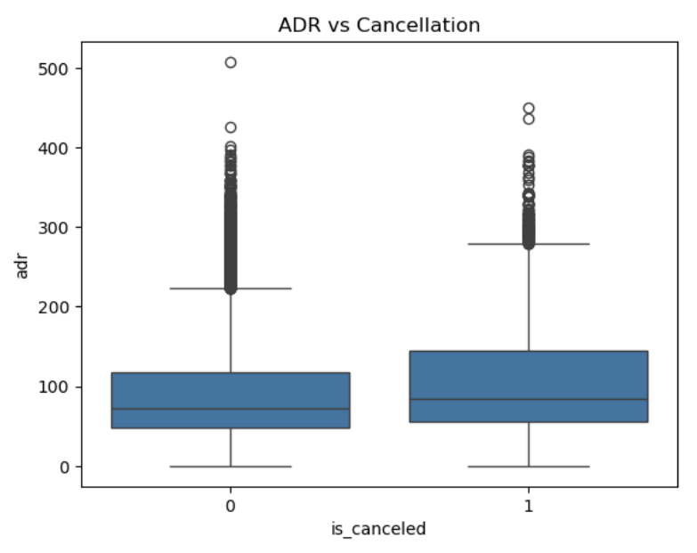

### 📊 Hotel Booking Cancellation Insights — Data Analysis & Business Recommendations

Goal:
Analyze hotel booking behavior & identify key drivers of reservation cancellations to help hotels reduce revenue loss and improve booking strategy.

Tools Used: Python, Pandas, Seaborn, Matplotlib
Modeling Approach: Logistic regression (binary classification)
Business Focus: Revenue management & cancellation prevention

### 🔍 Key Questions
| Question                                          | Why It Matters                       |
| ------------------------------------------------- | ------------------------------------ |
| What % of bookings get canceled?                  | Impacts occupancy planning & revenue |
| Do longer lead-time bookings cancel more?         | Helps optimize booking windows       |
| Does price (ADR) affect cancellations?            | To understand price sensitivity      |
| Who cancels more — groups, leisure, or corporate? | Target customer policy adjustment    |
| Do deposits reduce cancellations?                 | Revenue protection strategy          |
| Are repeat guests more reliable?                  | Customer value & loyalty insights    |

---
### 📂 Project Structure

├── hotel_cancellation_analysis.ipynb   # Analysis notebook
├── README.md                           # Documentation
├── requirements.txt                    # Python packages
└── images/                             # Visuals
    ├── cancellation_distribution.png
    ├── leadtime_vs_cancel.png
    ├── adr_vs_cancel.png
    ├── segment_vs_cancel.png
    ├── deposit_vs_cancel.png
    └── repeatguest_vs_cancel.png

---
## 📊 Key Insights

### ✅ 1️⃣ 27.8% booking cancellation rate

Nearly 1 in 3 bookings is canceled → high impact on revenue & forecasting.

---

### ✅ 2️⃣ Longer lead-time = higher cancellation

Guests who book far in advance are more likely to cancel → implement deposit / cancellation policy for early bookings.
---

### ✅ 3️⃣ Higher ADR = higher cancellation

Price-sensitive segment is canceling more → discount ladder or flexible pricing strategy may help.

---

### ✅  4️⃣ Online travel agencies & group bookings cancel the most

Online TA cancellations are 2.4× higher than direct bookings → encourage direct booking incentives.

---

### ✅ 5️⃣ Deposits dramatically reduce cancellations

Non-refundable bookings ≈ 95% don't cancel → deposits = strong safety net.

---

### ✅ Repeat guests rarely cancel

Loyalty pays off — returning guests are 5x more reliable.

---

## 💡 Business Recommendations

| Insight                                     | Recommendation                                             |
| ------------------------------------------- | ---------------------------------------------------------- |
| Long booking lead time → high cancellations | Require deposit or stricter terms for long-window bookings |
| Online OTA highest cancel source            | Push direct booking discounts & loyalty perks              |
| High-ADR cancellations                      | Offer refundable rate add-on, tier pricing                 |
| Repeat guests low cancellations             | Reward loyal users, pre-approve flexible cancellation      |
| Non-refund policies work                    | Increase non-refundable options w/ perks                   |

---

## 🚀 Next Steps (Future Work)

Build predictive model to score cancellation likelihood
Add Power BI dashboard
Create automated cancellation risk alerts for hotel CRM
Deploy as API (FastAPI) for hotel booking systems

---

## 💡 Key Takeaway

Data shows cancelers behave differently — pricing, booking channel, & lead time explain most cancellations.
Smart policy + loyalty focus can save revenue & increase stability.

---
Jing You
Data Analytics | Python | Power BI | Business Strategy
🔗 LinkedIn: ((https://www.linkedin.com/in/jing-you84/)
📂 Portfolio: ((https://github.com/JingYou-data))
