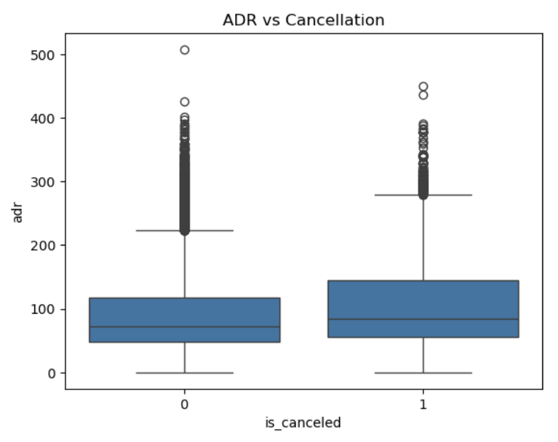

# 🏨 Hotel Booking Cancellation Analysis

<p align="center">
  
  
  
  
</p>

> **Analyzing hotel booking behavior to identify key drivers of cancellations — and translate findings into actionable revenue strategy.**

---

## 📌 Project Overview

Hotels lose significant revenue every year to booking cancellations. This project digs into real booking data to answer: **who cancels, when, and why** — and what policies can reduce that risk.

| | |
|---|---|
| **Dataset** | Hotel booking records (City Hotel + Resort Hotel) |
| **Records** | 119,390 bookings |
| **Cancellation Rate** | 27.8% — nearly 1 in 3 bookings |
| **Model** | Logistic Regression (binary classification) |
| **Tools** | Python, Pandas, Seaborn, Matplotlib, Scikit-learn |

---

## 🔍 Business Questions

| Question | Why It Matters |
|---|---|
| What % of bookings get canceled? | Impacts occupancy planning & revenue forecasting |
| Do longer lead-time bookings cancel more? | Helps optimize booking window policies |
| Does price (ADR) affect cancellations? | Reveals price sensitivity of different segments |
| Who cancels more — groups, OTA, or direct? | Guides channel-specific policy decisions |
| Do deposits reduce cancellations? | Tests revenue protection strategies |
| Are repeat guests more reliable? | Informs loyalty program investment |

---

## 📊 Key Findings

### 1️⃣ 27.8% Overall Cancellation Rate


Nearly **1 in 3 bookings is canceled** — a significant drag on revenue and occupancy planning.

---

### 2️⃣ Longer Lead Time = Higher Cancellation Risk


Guests who book far in advance are significantly more likely to cancel. **Early bookings need stronger commitment mechanisms** — deposits or stricter cancellation terms.

---

### 3️⃣ Higher Room Rate (ADR) = More Cancellations


Price-sensitive guests in higher-rate segments cancel more often. A **flexible rate tier** (refundable vs. non-refundable) could reduce cancellations while preserving revenue.

---

### 4️⃣ Online Travel Agencies Cancel 2.4× More Than Direct Bookings


OTA and group segments drive the majority of cancellations. **Direct booking incentives** (loyalty points, exclusive rates) can shift this balance.

---

### 5️⃣ Non-Refundable Deposits Reduce Cancellations by ~95%


This is the single most effective lever. Guests with non-refundable bookings almost never cancel — **deposit policy is a strong revenue safety net**.

---

### 6️⃣ Repeat Guests Are 5× More Reliable


Returning guests have dramatically lower cancellation rates. **Loyalty programs are not just nice-to-have — they directly protect revenue.**

---

## 💡 Business Recommendations

| Finding | Recommended Action |
|---|---|
| Long lead time → high cancellation | Require deposit or tighter terms for bookings >60 days out |
| OTA highest cancellation source | Push direct booking with exclusive perks & price match |
| High-ADR guests cancel more | Offer refundable rate add-on with small premium |
| Repeat guests rarely cancel | Expand loyalty program with flexible cancellation benefits |
| Non-refundable policies work | Increase non-refundable options bundled with value-adds |

---

## 📁 Repository Structure

```
hotel-cancellation-analysis/
├── hotel_cancellation_analysis.ipynb   # Main analysis notebook
├── README.md                           # Project documentation
├── requirements.txt                    # Python dependencies
└── images/
    ├── cancellation_distribution.png
    ├── leadtime_vs_cancel.png
    ├── adr_vs_cancel.png
    ├── segment_vs_cancel.png
    ├── deposit_vs_cancel.png
    └── repeatguest_vs_cancel.png
```

---

## 🚀 Future Work

- [ ] Build a predictive model to **score individual bookings** by cancellation risk
- [ ] Add a **Power BI dashboard** for hotel management reporting
- [ ] Create **automated cancellation risk alerts** for hotel CRM integration
- [ ] Deploy as a **FastAPI microservice** for real-time booking systems

---

## 👤 Author

**Jing You** — Data Analytics & Engineering  
[](https://www.linkedin.com/in/jing-you84/)
[](https://github.com/JingYou-data)
[](https://jingyou-data.github.io)
